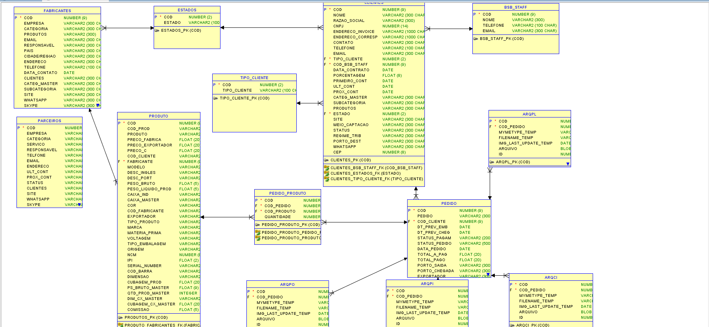

Este diretório do git possui arquivos guia para construção do aplicativo de auxilio para sistemas de demandas e importação.

Grupo:

Pedro Henrique Gonzaga - 140030131

Rodrigo Doria Vilaça - 140031111

Guilherme Andreúce - 140141961

Rômulo de Vasconcelos Feijão Filho - 140031260

Herbert Vargas - 140143262

Universidade de Brasilia

Disciplina: Engenharia de Software

-----------------------------------------------------------------------------

# INTRODUÇÃO

Neste trabalho de engenharia de software, iremos criar um sistema Gerenciador de Pedidos para empresas que trabalham com importação, exportação e consultoria. Utilizaremos métodos de desenvolvimento ágil aprendidos na matéria para
Teremos como cliente uma empresa real: BSB Trading. Através de reuniões com nossos clientes (funcionários da empresa), tentaremos entender o que eles de fato querem para aplicarmos no sistema.

Utilizaremos a ferramenta Trello para controle das atividades, e criação de histórias de usuário, assim como pontuar as mesmas.

Utilizaremos Apex para a criação do sistema.

## Funcionamento do Sistema

Ao abrir a aplicação via Apex, e realizar login em sua conta do sistema, poderá ter acesso a todas suas funcionalidades.
No centro encontrará as três principais (mais relevantes) funcionalidades do sistema: Pedidos, Alertas e Relatórios.
À esquerda, há uma barra de navegação com diversas funcionalidades para gerenciamento do banco de dados do sistema.
Para adicionar uma nova instância ao banco de dados, basta clicar no lugar que deseja (por exemplo: Clientes). Ao clicar, será redirecionado à página de clientes, onde todos clientes cadastrados irão aparecer. Para adicionar um novo, basta clicar em "Adicionar novo cliente", preencher seus atributos e ele será adicionado ao banco de dados.
Analogamente pode-se cadastrar produtos, funcionários, pedidos, parceiros e fabricantes.

Ao clicar em alertas, haverá um menu superior com os quatro diferentes tipos de alertas: Previsão de embarque, previsão de chegada, Data de Consultoria e Próximo contato de clientes.
Serão exibidos os pedidos ou clientes que estão com prazos próximos de vencer.

Por fim, ao clicar em relatórios, haverá uma página com todos os relatórios do banco de dados pedidos pelo cliente.

-----------------------------------------------------------------------------

# Stakeholders, problemas e necessidades

Os stakeholders do sistema consistem em funcionários da empresa de Importação, Exportação e Consultoria e os desenvolvedores do sistema.

Os funcionários da empresa terão acesso à aplicação como usuários. Podem realizar consultas no banco de dados, cadastrar novas instâncias, criar pedidos, visualizar alertas e relatórios.

Já os desenvolvedores terão acesso à toda plataforma de programação em Apex por trás do sistema.

## Problemas atuais e possíveis soluções.

Atualmente, a empresa controla seus dados por meio de tabelas de excel e explorador de arquivos. Não há de fato um banco de dados implementado, tudo consiste em arquivos em excel como se fossem tabelas de um banco de dados e nelas os seus dados, o que torna o controle e análise de dados uma tarefa extremamente difícil e demorada. Com o sistema automatizado, a empresa terá uma aplicação em Apex com um banco de dados em Oracle implementado de acordo com suas necessidades, deixando o fluxo de trabalho dos funcionários muito mais organizado, seguro e rápido. 

-----------------------------------------------------------------------------

# Arquitetura

Uma vez que o programa esta sendo desenvolvido em Apex, a arquitetura da aplicação consiste no navegador onde a aplicação estará rodando.

Ja para exemplificar a  arquitetura do Banco de dados, na figura abaixo temos a última versão do Modelo Entidade Relacionamento do BD. (O programa passou por diversos modelos, através de reuniões com o cliente e testes para chegar ao modelo final).

-----------------------------------------------------------------------------

# Experiência e Técnicas Utilizadas

